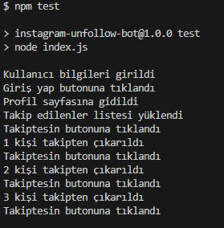

# Instagram Unfollow Bot

Bu bot, Instagram hesabınızdaki takip ettiklerinizi otomatik olarak takipten çıkarmak için tasarlanmıştır.

## Özellikler

- Otomatik Instagram girişi
- Takip edilenleri otomatik takipten çıkarma
- Güvenli bilgi saklama (.env dosyası ile)
- Özelleştirilebilir bekleme süreleri

## Kurulum

1. Repoyu klonlayın:
```bash
git clone https://github.com/enesbilen/instagram-unfollow-bot.git
cd instagram-unfollow-bot
```

2. Gerekli paketleri yükleyin:
```bash
npm install
```

3. `.env` dosyasını oluşturun:
```env
INSTAGRAM_USERNAME=your_username
INSTAGRAM_PASSWORD=your_password
INSTAGRAM_PROFILE_URL=https://www.instagram.com/your_username
```

## Kullanım

1. `.env` dosyasını kendi bilgilerinizle güncelleyin
2. Botu çalıştırın:
```bash
npm test
```

## Güvenlik

- `.env` dosyanızı asla GitHub'a pushlamayın
- Instagram şifrenizi güvende tutun
- Botu makul aralıklarla kullanın (Instagram limitlerini aşmamak için)

## Notlar

- Bot, her 5 saniyede bir kişiyi takipten çıkarır
- Instagram'ın günlük takipten çıkarma limitini aşmamaya dikkat edin
- Tarayıcı penceresini manuel olarak kapatabilirsiniz

## Screenshots


